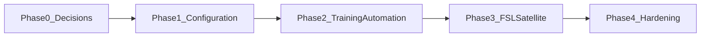

# Amazon Leo on OnboardV2 — high-level plan (management)

## One-sentence outcome

Deliver **Amazon Leo** (and related **Contractor Base**) dealer onboarding **inside Salesforce** by **configuring and extending** the existing **OnboardV2** model—vendor programs, requirement tracking, status engine, and operational territories—so dealers, technicians, and internal teams have **one system of record** from contract through **Field Service** readiness.

## What we already have (reduces risk and cost)

| Capability                                 | Business value                                                                                                                                                                                                                                                                 |
| ------------------------------------------ | ------------------------------------------------------------------------------------------------------------------------------------------------------------------------------------------------------------------------------------------------------------------------------ |
| **Vendor programs & requirements**         | Each program (**Vendor_Customization__c**) defines what must be completed; requirements roll up to **onboarding status** via the rules engine already in production use.                                                                                                       |
| **Who must complete what**                 | Principal owner vs all contacts vs account-level obligations are supported through **fulfillment policies** and **requirement subjects** ([subject fulfillment note](OnboardingV2Minimal/docs/implementation-notes/onboarding-requirement-subject-fulfillment-2026-03-16.md)). |
| **Program + onboarding territory**         | **Account** program territory and **Territory_Assignments__c** roster drive **who works the deal** (reps, recruiters, managers) — see [how-to-setup](OnboardingV2Minimal/docs/setup/how-to-setup-records.md).                                                                  |
| **Field Service territories (Production)** | **ServiceTerritory** with **vendor-based scheduling** (**Vendors** includes **Amazon**; blank means all vendors) — documented in [FSL territory reference](OnboardingV2Minimal/docs/architecture/field-service-territory-prod.md).                                             |

**Management takeaway:** This is primarily a **program delivery and integration** effort, not a greenfield build.

## What we must add or decide (scope buckets)

1. **Business rules in metadata** — Map the **BRD** (Amazon Leo requirements doc) to **requirement types**, statuses, and **status normalization** so denials and “setup complete” behave consistently ([playbook](OnboardingV2Minimal/docs/setup/vendor-program-amazon-leo-playbook.md)). Some BRD items (e.g. **ACH**, **W9**, **drug screening**) may need **new requirement types** or explicit design choices.
2. **O&O (owner-installer) branching** — Same account may need **different obligation sets** when the owner is also an installer. Preferred approach: **separate vendor program variants** or controlled automation (documented in [implementation plan](OnboardingV2Minimal/docs/implementation-notes/amazon-leo-field-service-plan-2026-03-25.md)).
3. **Multi-program per account** — **Separate onboarding instances** per opportunity/vendor program (e.g. Contractor Base vs Amazon Leo) so requirements and reporting stay clean.
4. **Drug screening** — **Ongoing compliance** (including **random** screens) should live on **contact-level records**, not only on a single onboarding row, with optional **rollup** during onboarding; supports scale and audit ([same plan §2.2](OnboardingV2Minimal/docs/implementation-notes/amazon-leo-field-service-plan-2026-03-25.md)).
5. **Training & FSL handoff** — LearnUpon / Amazon course completion and **Service Resource** activation gated on **background checks** and onboarding milestones; aligns **ServiceTerritoryMember** rules (e.g. primary territory + postal code) from Production FSL reference.
6. **Territory alignment** — Document and enforce how **program territory** (`Territory_Assignments__c` / Account) relates to **ServiceTerritory** naming and **Vendors** so schedulers are not blocked after go-live ([FSL doc](OnboardingV2Minimal/docs/architecture/field-service-territory-prod.md)).

## Phased delivery (timeline-ready)

| Phase | Name                    | Management-visible output                                                                                                 |
| ----- | ----------------------- | ------------------------------------------------------------------------------------------------------------------------- |
| **0** | Decisions & BRD mapping | Signed model for **O&O**, requirement **types**, **territory bridge**, and **drug-screen** data ownership.                |
| **1** | Program configuration   | **Vendor programs** + **requirements** + **status rules** + **comms templates** deployable; first **UAT** scenarios.      |
| **2** | Training & gates        | **Enrollment and completion** aligned to BRD gates; evidence flows to onboarding/subjects.                                |
| **3** | FSL & satellite records | **Insurance**, program dates, kickoff, **work-order/territory** behavior verified; **Vendors** on territories for Amazon. |
| **4** | Scale & go-live         | Performance/regression, **reporting**, **runbooks**, phased rollout.                                                      |

(Aligned with detailed technical checklist in [amazon-leo-field-service-plan-2026-03-25.md](OnboardingV2Minimal/docs/implementation-notes/amazon-leo-field-service-plan-2026-03-25.md).)

## Dependencies & risks (talk track)

- **Cross-team:** Sales/ops (opportunity & program selection), Field Service admins (territories & resources), compliance/vendors (BRD), integration (LearnUpon / Adobe where applicable).
- **Risk — dual territory concepts:** **Onboarding roster** vs **FSL ServiceTerritory** must stay documented; misalignment blocks scheduling or mis-assigns reps ([architecture doc](OnboardingV2Minimal/docs/architecture/field-service-territory-prod.md)).
- **Risk — scope creep:** Treat **post-onboarding random drug screens** as **compliance operations** with batch/queue design, not only “another requirement row.”

## Success measures

- Dealers complete **Contractor Base** and **Amazon Leo** tracks with **auditable** requirement and subject history.
- **Setup Complete** correlates with **schedulable** work in **FSL** for the right **vendor** (**Amazon** / blank).
- Ops can **report** by **account**, **program**, **territory**, and **resource**.
- **Management** has a single **BRD-to-Salesforce** mapping maintained in repo docs for ongoing changes.

## Source documents for detail

- [Amazon Leo playbook](OnboardingV2Minimal/docs/setup/vendor-program-amazon-leo-playbook.md) — BRD vs metadata mapping and gaps.  
- [Amazon Leo + FSL implementation plan](OnboardingV2Minimal/docs/implementation-notes/amazon-leo-field-service-plan-2026-03-25.md) — phases, risks, multi-program, drug screening, territories.  
- [Field Service territory (Production)](OnboardingV2Minimal/docs/architecture/field-service-territory-prod.md) — FSL side for technicians and scheduling.

