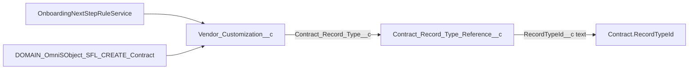

# Consolidate Contract record types to Program Acquisitions

## Current architecture (this repo)

- **Indirection**: `[Contract_Record_Type_Reference__c](force-app/main/default/objects/Contract_Record_Type_Reference__c/Contract_Record_Type_Reference__c.object-meta.xml)` stores `RecordTypeId__c` (text). `[Vendor_Customization__c](force-app/main/default/classes/OnboardingNextStepRuleService.cls)` uses lookup `Contract_Record_Type__c` → reference row → Id.
- **Runtime resolution**: `[OnboardingNextStepRuleService.cls](force-app/main/default/classes/OnboardingNextStepRuleService.cls)` (`resolveVendorProgramContractRecordType`, `insertSiblingContract`, `alignContractRecordTypeIfNeeded`).
- **Flow contract create**: `[DOMAIN_OmniSObject_SFL_CREATE_Contract.flow-meta.xml](force-app/main/default/flows/DOMAIN_OmniSObject_SFL_CREATE_Contract.flow-meta.xml)` (hydration + `RecordTypeId` on create).
- **Seeding / template sync**: `[VendorProgramSeedService.cls](force-app/main/default/classes/VendorProgramSeedService.cls)` (`seedContractRecordTypeReferences`, vendor program keys include `Contract_Record_Type__c`).
- **Metadata surface**: [63 Contract `recordTypes](force-app/main/default/objects/Contract/recordTypes/)` under `objects/Contract/recordTypes/` (plus validation rules, webLinks, layouts tied to types in full org—not all may be in this minimal repo).

Business approval gates: **final label/API name** of the single record type (you called it “Program Acquisitions”; confirm **DeveloperName** and that it exists in each target org before migration).

---

## Phase 0 — Inventory (read-only checklist before any change)

Complete in **each** org (prod + sandboxes) and cross-check repo:

| Area               | What to list                                                                                                                                                            |
| ------------------ | ----------------------------------------------------------------------------------------------------------------------------------------------------------------------- |
| **Data**           | `Contract` counts **by** `RecordTypeId`; orphan or integration-owned contracts                                                                                          |
| **Config**         | All `Vendor_Customization__c` rows with `Contract_Record_Type__c` → distinct reference Ids                                                                              |
| **Reference rows** | All `Contract_Record_Type_Reference__c` rows (`Name`, `Developer_Name__c`, `RecordTypeId__c`)                                                                           |
| **Automation**     | Flows/Apex referencing `Contract.RecordTypeId`, `Contract_Record_Type__c`, or `Contract_Record_Type_Reference__c` (repo: above files; org: Setup search)                |
| **UX/rules**       | Contract validation rules, page layouts, compact layouts, Lightning record pages **per** record type; profiles/permission sets **record type** assignments for Contract |
| **Integrations**   | DocuSign/Vlocity/CPQ (many `Send_`* webLinks under Contract in repo); reports/dashboards filtered by record type                                                        |

Deliverable: spreadsheet mapping **old RecordType Id → Program_Acquisitions Id** (or DeveloperName → Id from `Schema.SObjectType.Contract.getRecordTypeInfosByDeveloperName()`).

---

## Phase 1 — Target state (choose one; recommend A for lowest risk)

**Option A — Keep `Contract_Record_Type_Reference__c`, collapse to one logical row**

- Create **one** reference row (e.g. name “Program Acquisitions”) with `RecordTypeId__c` = new type’s Id.
- Point **every** `Vendor_Customization__c.Contract_Record_Type__c` to that row (data migration).
- Stop seeding/maintaining per-vendor contract RT rows in `[VendorProgramSeedService](force-app/main/default/classes/VendorProgramSeedService.cls)` (or make seed a no-op / single-row upsert).
- **Minimal** Apex/Flow change: resolution path unchanged; only data points to one Id.

**Option B — Remove lookup; hardcode or CMDT single Id**

- Add Custom Metadata (or named constant) `Default_Contract_Record_Type_Id__c`.
- Change `[OnboardingNextStepRuleService](force-app/main/default/classes/OnboardingNextStepRuleService.cls)` and `[DOMAIN_OmniSObject_SFL_CREATE_Contract](force-app/main/default/flows/DOMAIN_OmniSObject_SFL_CREATE_Contract.flow-meta.xml)` to use CMDT when creating contracts; deprecate `Vendor_Customization__c.Contract_Record_Type__c` (longer project: field retirement, tests, seed scripts).

**Recommendation**: **Option A** until business confirms no future need for per-program Contract RT differences; Option B as a second wave to delete the custom object and lookup.

---

## Phase 2 — Data migration (after Program Acquisitions RT exists)

Run in **maintenance window** or batched jobs with logging:

1. **Contracts**: `UPDATE` all `Contract` records from **legacy** `RecordTypeId` values to **Program Acquisitions** `RecordTypeId` (batch Apex or Data Loader).
  - Preconditions: **validation rules** and **required fields** identical or relaxed for the target type; otherwise migrate in waves per legacy type after rule/layout alignment.
2. `**Vendor_Customization__c`**: set `Contract_Record_Type__c` → single `Contract_Record_Type_Reference__c` Id (or null if moving to Option B + code path).
3. `**Contract_Record_Type_Reference__c`**: either **update** all rows’ `RecordTypeId__c` to the new Id (quick) then delete duplicate rows, or **repoint** VPs first then delete obsolete reference rows.
4. **Verify**: sample queries + UI smoke (create sibling contract, run `DOMAIN_OmniSObject_SFL_CREATE_Contract`, onboarding next-step).

Rollback: keep CSV of **old** `Contract.Id` + `RecordTypeId` before mass update; restore only if business approves rollback window.

---

## Phase 3 — Code and automation (repo)

Aligned with **Option A**:

- `[VendorProgramSeedService.cls](force-app/main/default/classes/VendorProgramSeedService.cls)`: simplify `seedContractRecordTypeReferences` to upsert **one** reference or skip when org is “single RT mode” (feature flag or CMDT toggle if you need gradual rollout).
- `[OnboardingNextStepRuleService.cls](force-app/main/default/classes/OnboardingNextStepRuleService.cls)`: optional shortcut—if `Contract_Record_Type__c` blank, resolve **default** Program Acquisitions Id from CMDT (reduces dependence on VP data quality).
- `[DOMAIN_OmniSObject_SFL_CREATE_Contract.flow-meta.xml](force-app/main/default/flows/DOMAIN_OmniSObject_SFL_CREATE_Contract.flow-meta.xml)`: mirror same default resolution if Flow must not fail when reference missing.
- Tests: `[OnboardingNextStepRuleInvocableTest.cls](force-app/main/default/classes/OnboardingNextStepRuleInvocableTest.cls)` — assert against **Program Acquisitions** DeveloperName once stable in scratch org / CI.

Aligned with **Option B** (later): remove Flow get of `Contract_Record_Type_Reference__c`, remove/deprecate lookup field, update all tests and seed scripts.

---

## Phase 4 — Metadata decommission (org + repo, last)

Only after **zero** production dependency on legacy types:

- **Org**: deactivate or delete legacy Contract record types (Salesforce may block delete if still assigned; ensure **profiles** no longer assign unused types).
- **Repo**: remove unused files under `[objects/Contract/recordTypes/](force-app/main/default/objects/Contract/recordTypes/)` in sync with org (large diff; do per release).
- Reconcile **validation rules** and **webLinks** that were scoped to specific record types—merge into single-type rules or drop RT-specific branches.

---

## Phase 5 — Governance

- Document the **single** canonical Contract record type for onboarding-created contracts (runbook + ADR).
- Add a **promotion checklist**: new sandboxes get Program Acquisitions RT + one reference row (or CMDT) before seed scripts run.

---

## Dependencies on business approval

- **Program Acquisitions** exact **DeveloperName** and that **layouts/validation** for that type support all fields/requiredness currently spread across legacy types.
- Approval to **retype** historical Contracts (legal/reporting impact).
- List of **legacy** record types in scope for migration (your “list” — becomes the Phase 0 mapping sheet).

No open technical question blocks drafting this plan; if business later chooses **Option B**, Phases 2–3 expand to field retirement and broader Flow/Apex edits.