# Performance plan: EXP Opportunity Create Record screen flow

## Current shape (from metadata)

- Entry: [EXP_Opportunity_SCR_Create_Record.flow-meta.xml](force-app/main/default/flows/EXP_Opportunity_SCR_Create_Record.flow-meta.xml) starts at `Get_Account_Record`, includes Apex (`VendorOnboardingJsonAdapter`, `OnboardingDefaultVendorProgramInvocable`), one large main screen (`Create_Opportunity_Screenflow`), then a **sequential** create chain via subflows: `Create_Opportunity_Record` → contact/role steps → `Create_Contract_Record` → `Create_Onboarding_Record` (and DOMAIN flows like [DOMAIN_OmniSObject_SFL_CREATE_Onboarding_Record.flow-meta.xml](force-app/main/default/flows/DOMAIN_OmniSObject_SFL_CREATE_Onboarding_Record.flow-meta.xml) are themselves large).
- `Experience_Create_Opportunity_Contacts` / `Experience_Create_or_Update_Contacts` already accept `PerformDmlAsynchronously` (pattern exists to push some DML off the interview).
- UI screens are few (main + `Prompt_User_to_Refresh_Sceen` + error); perceived “phases” are likely **sections/LWCs on one screen** and/or **parent flows** chaining interviews, plus the **final synchronous chain** after submit.

```mermaid
flowchart LR
  start[Start] --> account[Get_Account_Record]
  account --> prep[Lookups_Apex_Decisions]
  prep --> screen[Create_Opportunity_Screenflow]
  screen --> opp[Create_Opportunity_Record]
  opp --> contacts[Contacts_ACRs]
  contacts --> roles[OCR_roles]
  roles --> contract[Create_Contract]
  contract --> ob[Create_Onboarding_DOMAIN]
  ob --> done[Finish_or_Refresh_prompt]
```

---

## 1. Measure before restructuring

- Turn on **Flow/Lightning debug** for a slow path and note time **before first screen**, **on each Next/Finish**, and **per subflow** (check Debug Logs for `FLOW_START` / invocable / DML rows).
- In setup, use **Event Monitoring** (if licensed) or coarse **debug log limits** to spot Apex CPU, SOQL count, and DML rows inside DOMAIN flows (onespecially onboarding).
- Document which elements dominate: SOQL loops, redundant lookups, agreements/LearnUpon branches, fault-handler subflows (each `DOMAIN_OmniSObject_SFL_CREATE_Fault_Message` adds work on errors).

Outcome: a ranked list so you do not “optimize” cold components.

---

## 2. Shorten what must run inside the screen interview

**2a. Minimal synchronous “commit point”**

- Define the **smallest set** that must be done before the user leaves (e.g. Account patch + Opportunity insert + primary OCR + Contract stub if downstream automations require it).
- Move **enrichment** (training/LearnUpon, secondary junctions, non-blocking requirements) to **post-commit** processing (see §4).

**2b. One Invocable “orchestrator” instead of many Flow nodes**

- Replace long chains of Flow elements + nested subflows with **one bulk-safe Apex invocable** (or a small number: “persist core graph”, “enqueue extras”) to cut Flow interview overhead and repeated transaction boundaries. Keeps ordering explicit in code with **clear rollback story** (or compensating pattern if partial success is allowed).

**2c. Consolidate DOMAIN subflows where order is fixed**

- If several DOMAIN_* flows only exist for modularity, **merge** read-only prep into fewer passes and **batch DML** (Flow tends toward row-by-row patterns; Apex consolidates naturally).

---

## 3. Multi-step UX without one giant interview (optional)

- Split into **2–3 screen flows** launched from a **wrapper LWC** (tabs or stepper): step 1 capture + validate, step 2 contacts, step 3 confirm. Pass record ids as input between runs.
- Pros: smaller saved interview state, faster loads per step, clearer spinners. Cons: more navigation work; must pass context (ids, flags) reliably.

---

## 4. Async / deferred processing (keep UX strong)

**4a. Autolaunched flow + Platform Event**

- On successful Opportunity (or Contract) id: publish a **Platform Event** (include correlation id / `InterviewGuid`). Subscriber: **autolaunched flow** or **Trigger** that runs heavy DOMAIN-equivalent work.
- UX: immediate **success screen** with “We’re finishing onboarding setup” + link to Opportunity; optional **polling** a lightweight status field on Onboarding/Opportunity or a small **custom “job status”** object.

**4b. Queueable / `System.enqueueJob` from invocable**

- Same as above but Apex enqueues work; easier for **retry** and **limits** control than a giant Flow.

**4c. `PerformDmlAsynchronously` and related flags**

- Extend the existing pattern: any child path that does not need to complete before the next synchronous step should use **async DML** or **enqueue** (document which downstream steps truly depend on which records).

**4d. Pause / Wait elements**

- Rarely make users faster; use only if you must **wait for an external signal** or break governor-heavy chunks with clear messaging. Not first choice for pure speed.

**4e. Salesforce Orchestration (if you standardize on it)**

- Model long-running work as orchestration with stages; still need a clean UX story for “not done yet” (status + notifications).

---

## 5. LWC and `refreshApex` (front-of-house)

- **Problem `refreshApex` solves:** stale `@wire` / cached imperative results after mutations.
- **Performance rule:** never blanket-refresh every reactive input change; **scope** refresh to the mutation boundary (e.g. after save, or when a dependency picklist changes and you must refetch).
- Prefer `**getRecord` / `getRecords`** with narrow field lists, `**@wire` cacheable Apex** for picklists/options loaded once per screen, and **lazy load** heavy components (e.g. vendor widget only when branch visible).
- For dependent picklists / JSON vendor options: prefetch what you can **before** showing the heavy section (e.g. same Apex as today but triggered once on entry, not on every section transition).

---

## 6. Transaction and Flow runtime settings

- Review **Flow Transaction Model** on Apex actions (today `Automatic` on the two Apex calls in EXP) and on DML-heavy elements in DOMAIN flows where applicable—avoid accidental “current record vs all records” misuse that causes extra passes.
- Where business rules allow, run **non-dependent** record updates in **one Update Records** with collections instead of loops (Audit DOMAIN flows for loop + DML anti-patterns).

---

## 7. Data and automation hygiene (often free wins)

- Remove or **deferred order** redundant **Get Records** that repeat the same query after a create (reuse output variables).
- Audit **record-triggered flows / PB / triggers** on objects touched in the chain; async path or **recursion** here often dominates wall time at the end.
- Ensure **indexes/selectivity** for lookup elements used in DOMAIN flows (slow queries amplify tail latency).

---

## 8. Error handling and observability (avoid accidental slowness)

- Fault connectors that call [DOMAIN_OmniSObject_SFL_CREATE_Fault_Message](force-app/main/default/flows/DOMAIN_OmniSObject_SFL_CREATE_Fault_Message.flow-meta.xml) are correct for supportability but add work; keep them but **avoid faulting on recoverable branches**.
- Add lightweight **structured logging** (existing `OnboardingErrorLogService` / patterns in repo) around any new Apex orchestrator so you can compare before/after timings in production.

---

## 9. Recommended decision sequence

1. **Profile** the slow path (where time goes: Flow vs Apex vs DML vs automation).
2. **Freeze product-critical ordering** (what must be synchronous vs eventual consistency).
3. **Implement the smallest high-impact change** (usually: shrink synchronous tail + enqueue post-commit work + status UX).
4. Optionally **refactor** DOMAIN chains into invocable Apex for bulk + clarity.
5. **Tune LWCs** (caching, scoped `refreshApex`, lazy sections).

This stack preserves a strong UX: fast acknowledgement after submit, clear messaging, deep links, and optional real-time completion via polling or **Lightning Message Service** if a detail page is open—all without forcing the user to watch one spinner for the entire DOMAIN onboarding graph.