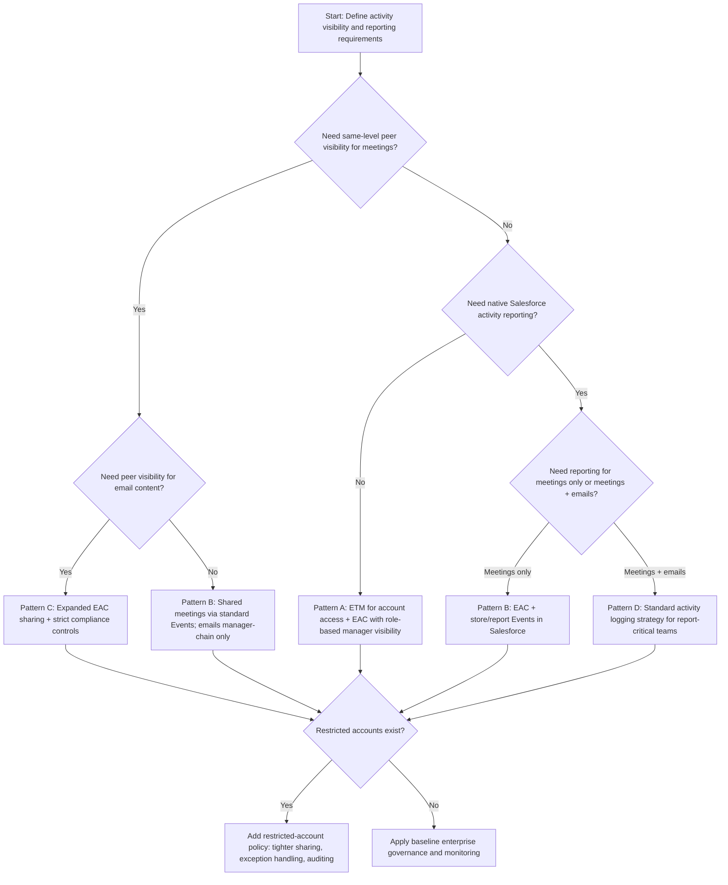

# Enterprise Pattern: ETM + Outlook + Einstein Activity Capture

This document provides:
- A recommended architecture pattern for `Enterprise Territory Management + Outlook + EAC`
- A decision tree for selecting the right visibility and reporting model
- A sample enterprise configuration blueprint

## Recommended Architecture Pattern

Recommended default for enterprise sales organizations:

`Role-anchored activity visibility + Territory-based account access + selective standard activity storage for reporting`

### Why this pattern

- `ETM` cleanly solves account access across shared teams and overlays.
- `Role hierarchy` provides predictable manager visibility for activity.
- `EAC` supports modern Outlook capture and timeline productivity.
- Selective use of standard Salesforce events/tasks closes reporting gaps where required.

### Pattern principles

1. Keep account access and activity visibility as separate design concerns.
2. Use role hierarchy for management visibility, not territory rules.
3. Use ETM for shared-account access, not as an activity-sharing substitute.
4. Make reporting requirements drive whether activities must exist as standard records.
5. Apply stricter policies for strategic/restricted accounts.

## Reference Architecture

### Layer 1: Account access
- Account OWD: `Private`
- ETM enabled with territory hierarchy by business segmentation
- Accounts allowed in multiple territories when shared coverage is needed
- Optional Account Teams for exceptions

### Layer 2: Activity visibility
- Managers inherit subordinate visibility through role hierarchy
- Same-level peer visibility explicitly configured (not assumed)
- Overlay visibility addressed with policy-driven sharing and role/record strategy

### Layer 3: Sync and capture
- Outlook integration via EAC
- Sync scope set by business unit: events-only or events+emails
- Sync direction and association behavior standardized by policy
- Standard event/task storage enabled where analytics/compliance require it

### Layer 4: Reporting and governance
- Executive dashboards sourced from reportable activity data model
- Governance board owns changes to ETM, role model, and EAC settings
- Sandbox validation required before ETM activation or major sharing changes

## Decision Tree Diagram

## Pattern Options Summary

| Pattern | Best for | Tradeoff |
|---|---|---|
| Pattern A: Pure EAC visibility model | Privacy-first teams, manager-led visibility | Limited native activity reporting and peer collaboration |
| Pattern B: Hybrid with standard Events | Shared meeting visibility + reporting | More configuration and governance overhead |
| Pattern C: Broad EAC sharing | Collaboration-first orgs | Higher privacy/compliance risk; policy complexity |
| Pattern D: Standard activity-first | KPI-heavy compliance/reporting environments | Higher user/process discipline required |

## Sample Enterprise Configuration Blueprint

Use this as a starting blueprint and tailor by segment.

### 1. Security and sharing baseline

| Domain | Recommended configuration |
|---|---|
| Account OWD | `Private` |
| Opportunity OWD | `Private` (or controlled by parent if aligned) |
| Contact OWD | `Controlled by Parent` |
| ETM | Enabled, active model with clear hierarchy and assignment rules |
| Role Hierarchy | Mirrors management chain for guaranteed upward activity visibility |
| Restricted Accounts | Dedicated process and exception visibility policy |

### 2. Territory model blueprint

| Element | Recommendation |
|---|---|
| Territory dimensions | Geography + segment + strategic named accounts |
| Overlay support | Separate overlay territories with explicit access policy |
| Multi-territory account support | Enabled where joint coverage is expected |
| Realignment cadence | Monthly or quarterly with formal change window |
| Activation controls | Sandbox simulation, impact sign-off, production activation checklist |

### 3. EAC and Outlook blueprint

| Element | Recommendation |
|---|---|
| Sync scope | Events + emails for leadership/core selling roles; events-only for sensitive groups as needed |
| Sync direction | Two-way events where user scheduling workflows require it |
| Association | Account/Contact matching policy documented and trained |
| Manager visibility | Through role hierarchy |
| Peer visibility | Explicit EAC sharing policy or standard Events for meeting collaboration |
| Email privacy controls | Segment by role/profile and restricted account policy |

### 4. Reporting blueprint

| Reporting need | Recommended approach |
|---|---|
| Meeting volume by rep/territory | Store/report standard Events for in-scope teams |
| Executive activity dashboards | Use reportable objects as source of truth |
| Email engagement KPIs | Validate EAC limitations; use approved supplemental model if required |
| Audit and retention | Align with legal/compliance policy and data retention controls |

### 5. Governance operating model

| Function | Owner |
|---|---|
| EAC policy + license assignment | Sales Operations + Salesforce Platform Team |
| Territory structure + activation | Revenue Operations |
| Role hierarchy governance | HR Operations + Salesforce Platform Team |
| Reporting definitions | Analytics/BI + Sales Leadership |
| Compliance sign-off | Security/Legal/Compliance |

## Recommended Implementation Sequence

1. Confirm business stance on collaboration vs privacy.
2. Finalize role hierarchy and ETM model together.
3. Pilot EAC sync and visibility settings with one region/team.
4. Validate reporting outputs against executive dashboard requirements.
5. Roll out in waves with governance checkpoints and audit reviews.
